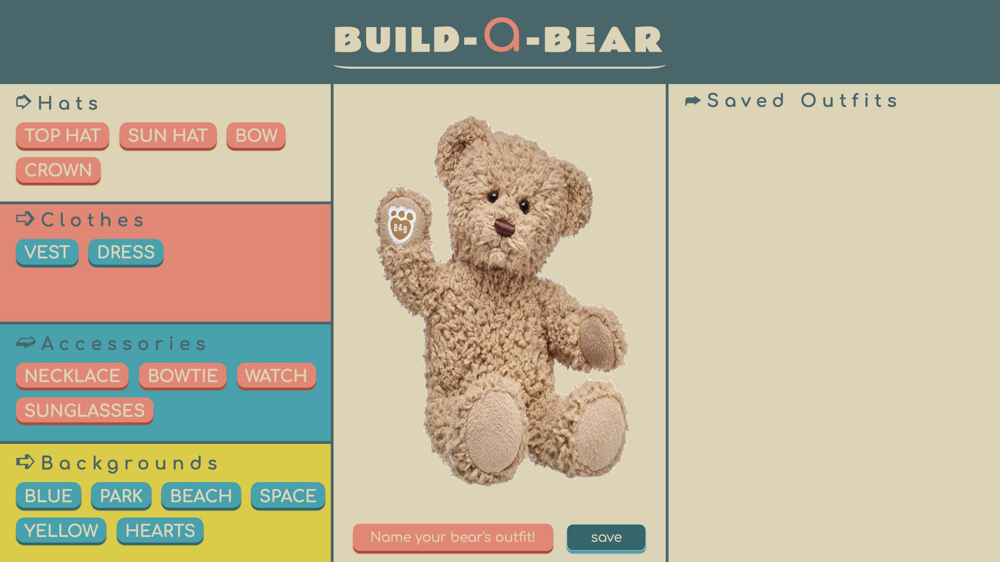
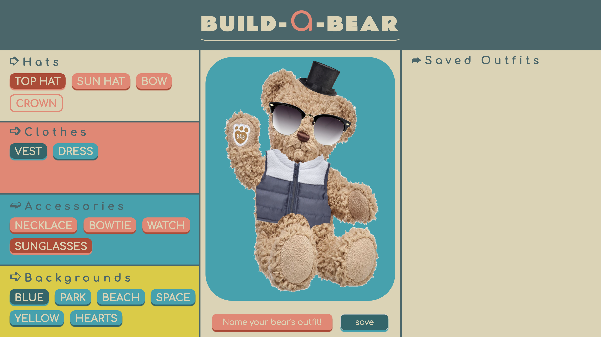
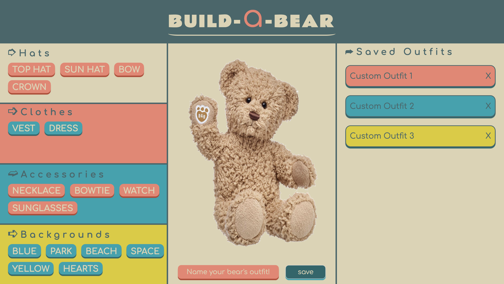
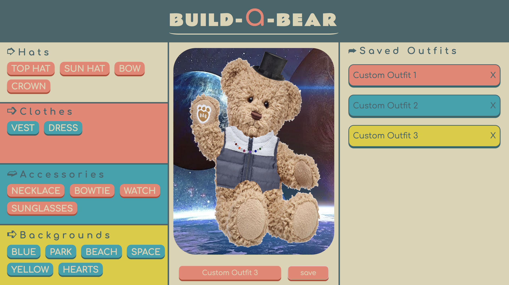

# Build-A-Bear
Build-A-Bear is a webpage that allows the user to generate outfits and backgrounds for the bear and save them.

## Contributing
This project was created by Justin Corbin, Tim Nguyen, and John Watterson.

### Comp Goals

Build-A-Bear goals involved creating a functional webpage capable of saving outfits generated by the user. Contributions for all members were to use three languages to include HTML, CSS, and JavaScript.

# Zero State Challenges

Linking objects in JavaScript to coexist with one another.

)

# Outfit Creation Challenges

Displaying DOM items and having them update also into the array.

# Save Outfit Challenges
Challenges included trying to pull ID buttons to match up with the ID of the object items.

# Outfit Reload Challenges
Getting the object out of local storage, parsing it back into useable information. Then searching through the object to repopulate the DOM.

## Overall Wins and Lessons Learned

How to effectively use local storage to save items. Having a better grasp of how to use Object and when they should be used.
